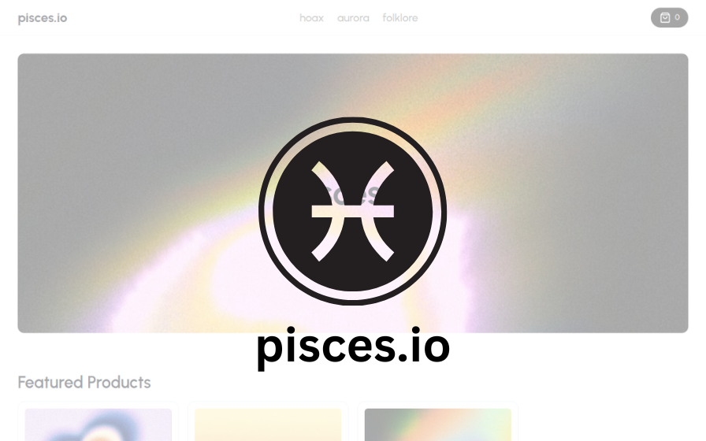

# IT GAMING TOUR 2023: THE X AGENT
#### _Tran Ngoc Dang Khoi_

#


## Getting Started

First, run the development server:

```bash
npm run dev
# or
yarn dev
# or
pnpm dev
```


### Available test-card for buying feature:
| Brand      | Number         | CVC                 | Zip | Date
| :--------------| :-------------- | :----------------- | :----------------- |:----------------- |
| Visa   | 4242424242424242          | Any | 10001| Any|


## Deploy on Vercel

The easiest way to deploy your Next.js app is to use the [Vercel Platform](https://vercel.com/new?utm_medium=default-template&filter=next.js&utm_source=create-next-app&utm_campaign=create-next-app-readme) from the creators of Next.js.

Check out our [Next.js deployment documentation](https://nextjs.org/docs/deployment) for more details.
